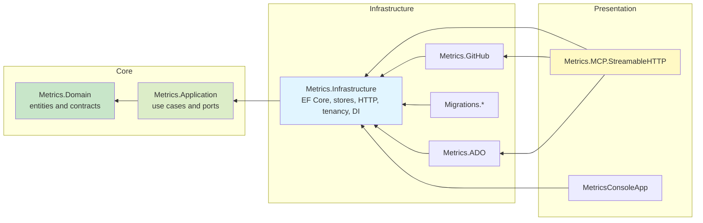
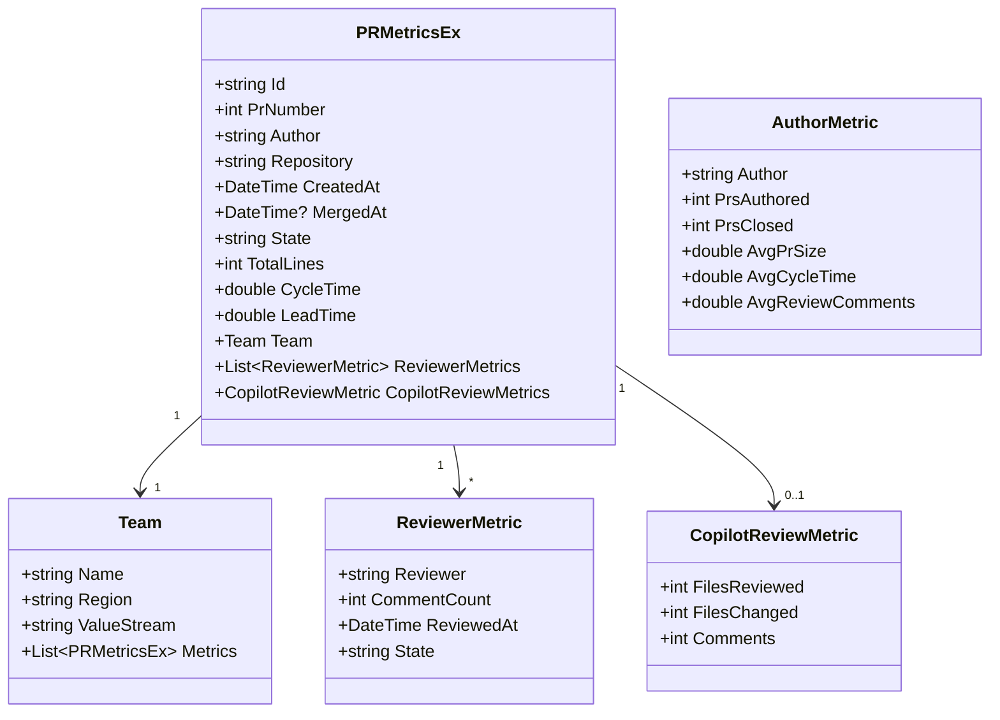
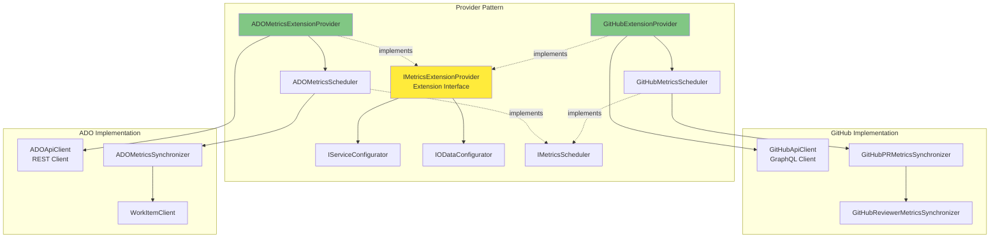
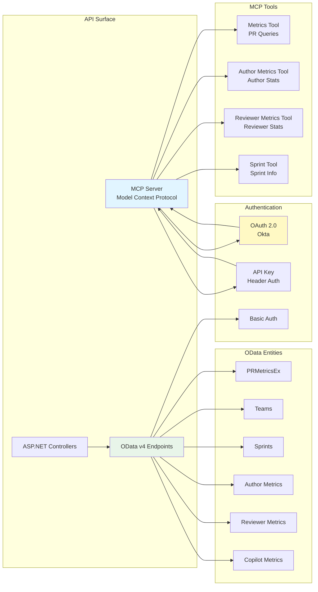
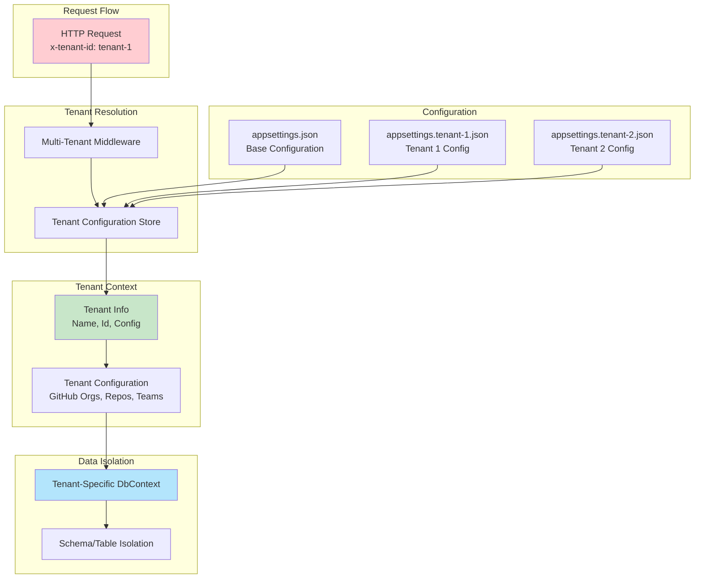
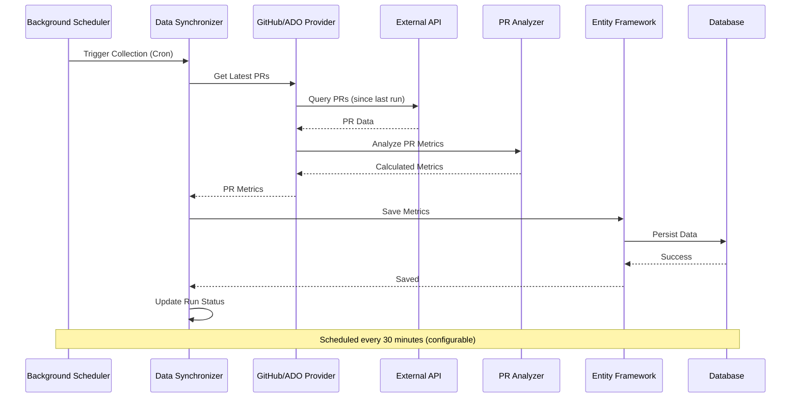
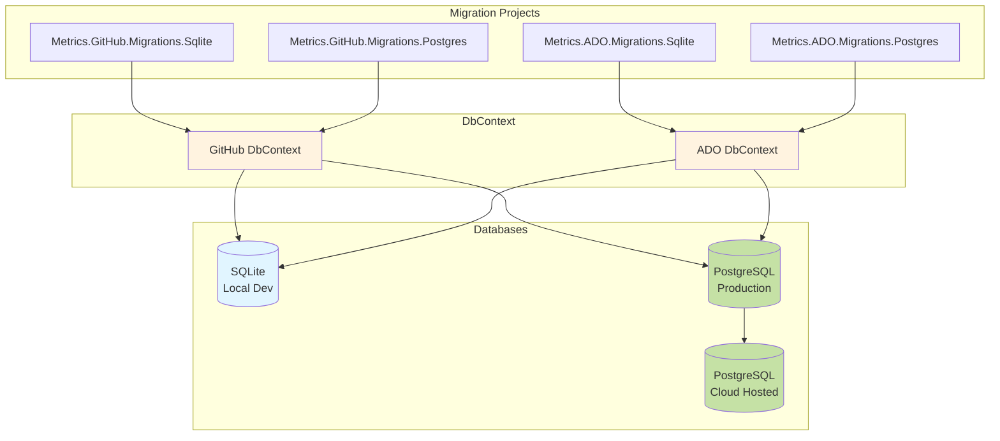
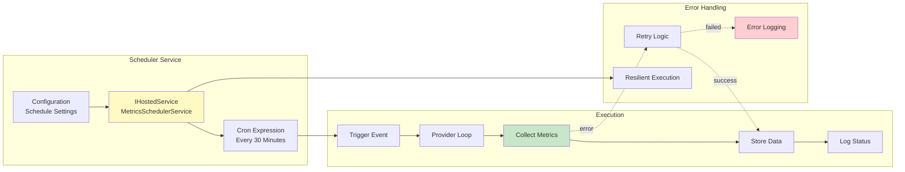
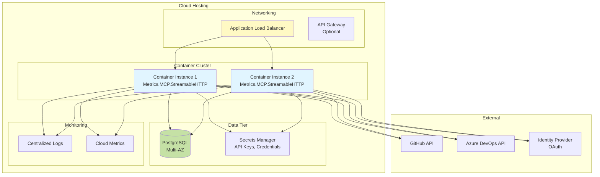

# DevMetrics Architecture

## Overview

DevMetrics is a multi-tenant, cross-platform .NET 10.0 solution designed to extract, analyze, and report software engineering metrics from multiple source control platforms (GitHub, Azure DevOps). The system provides flexible querying capabilities through OData endpoints, MCP (Model Context Protocol) integration, and supports multiple database backends.

## Architecture Principles

The solution is organised as a clean architecture. **Dependencies point inwards only**: hosts
depend on adapters, adapters depend on use cases, use cases depend on the domain, and the
domain depends on nothing. Anything the inner layers need from the outside world is expressed
as a *port* (an interface declared inwards) and satisfied by an *adapter* (an implementation
supplied outwards).

Alongside that:

- **Multi-Tenant**: isolated data and configuration per tenant, reached through the
  `ITenantSettingsProvider` port rather than a concrete tenant store
- **Provider Pattern**: GitHub and Azure DevOps plug in as runtime-loaded extensions
- **Database Agnostic**: SQLite and PostgreSQL with provider-specific migration assemblies
- **API First**: OData endpoints and MCP tools over the same application services
- **Background Processing**: scheduled collection driven by an infrastructure hosted service
- **Cloud Native**: OAuth 2.0, containerisation, cloud database support

### Layers

| Layer | Projects | Allowed dependencies |
|---|---|---|
| Domain | `src/Core/Metrics.Domain` | BCL only, plus the `[MultiTenant]` marker attribute |
| Application | `src/Core/Metrics.Application` | Domain and `Microsoft.Extensions.*.Abstractions` |
| Infrastructure | `src/Infrastructure/Metrics.Infrastructure`, `Metrics.GitHub`, `Metrics.ADO`, `Migrations/*` | Domain, Application, any package |
| Presentation | `src/Presentation/Metrics.MCP.StreamableHTTP`, `MetricsConsoleApp` | every layer |

Each project declares its layer through the `MetricsLayer` MSBuild property, and
`tests/Metrics.ArchitectureTests` fails the build when a project reference or package
reference breaks the rule above.



### Ports and adapters

| Port (Application) | Adapter (Infrastructure) | Purpose |
|---|---|---|
| `IMetricsPersistenceService` | `MetricsPersistenceService<TContext>`, `FilePersistenceService`, `DefaultPersistenceService` | storage-agnostic metric persistence |
| `ITenantSettingsProvider` | `TenantConfigurationService` | per-tenant configuration without knowing how tenants resolve |
| `IOrganizationApiClient` | `ApiClient` and its provider subclasses | source-control API calls used by team resolution |
| `IMetricsExtensionProvider`, `IServiceConfigurator`, `IODataConfigurator` | `GitHubExtensionProvider`, `ADOMetricsExtensionProvider` | provider registration and OData model contribution |
| `IMetricsScheduler` | `GitHubMetricsScheduler`, `ADOMetricsScheduler` | scheduled collection per provider |

Two contracts deliberately stay in the infrastructure layer because they expose Entity
Framework types: `IDbContextMetricsPersistenceService`, for callers that compose queries
directly against the EF model, and `IDataMigration<TContext>`, for data migrations.

### Accepted compromises

- Domain entities carry persistence annotations (`[Table]`, `[Column]`, `[MultiTenant]`)
  rather than separate `IEntityTypeConfiguration` classes. Moving the mapping out would risk
  silently changing the generated schema, so the annotations stay and the domain project
  references no database provider.
- `IODataConfigurator` lives in the application layer and pulls in
  `Microsoft.OData.ModelBuilder` (the EDM builder, not ASP.NET Core), because provider
  extensions contribute to the OData model and the host is the only thing that hosts it.

## Component Architecture

### 1. Core Components

#### Metrics.Application (use cases and ports)
- **Purpose**: Orchestrates the work the system does, and declares the ports it needs
- **Key Responsibilities**:
  - Data synchronization orchestration
  - Metrics calculation and analysis
  - Sprint calendar management
  - User membership and team resolution
  - Port definitions for persistence, tenant settings and source-control APIs

**Key Classes**:
- `DataSyncService`: Orchestrates data synchronization across providers
- `DataSynchronizer`: Base synchronization logic
- `MetricProvider`: Factory for creating metric providers
- `PRAnalyzer`: Pull request analysis and metrics calculation
- `ConfigService`: Configuration management
- `SprintCalendar`: Sprint/release date calculations

#### Metrics.Domain
- **Purpose**: Entities, settings records and domain contracts, free of infrastructure
- **Key Entities**:
  - `PRMetricsEx`: Extended PR metrics model
  - `DevExMetric`: Developer experience metrics
  - `Team`: Team information
  - `AuthorMetric`: Author productivity metrics
  - `ReviewerMetric`: Reviewer performance metrics
  - `CopilotReviewMetric`: GitHub Copilot review statistics
  - `Sprint`: Sprint/release information



#### Metrics.Infrastructure (adapters)
- **Purpose**: Implements the application ports and owns every framework dependency
- **Key Responsibilities**:
  - EF Core contexts and persistence services (`Persistence/`)
  - File and API backed stores (`Persistence/`)
  - HTTP client base and retry policies (`Http/`)
  - Tenant resolution and configuration layering (`MultiTenant/`)
  - Background scheduling (`Scheduling/`)
  - DI composition root, `AddDIServices` (`DependencyInjection/`)

### 2. Provider Pattern

The system uses an extensible provider pattern to support multiple source control systems.



#### Metrics.GitHub
- **Purpose**: GitHub-specific implementation
- **Features**:
  - GraphQL API integration
  - PR metrics synchronization
  - Reviewer metrics tracking
  - Copilot review analytics
  - Team membership resolution
  - Commit-level analysis

**Key Classes**:
- `GitHubExtensionProvider`: Provider registration and configuration
- `GitHubApiClient`: GraphQL API client
- `GitHubPRMetricsSynchronizer`: PR data synchronization
- `GitHubReviewerMetricsSynchronizer`: Reviewer data synchronization
- `GitHubMetricsScheduler`: Scheduled data collection

#### Metrics.ADO (Azure DevOps)
- **Purpose**: Azure DevOps-specific implementation
- **Features**:
  - REST API integration
  - Work item tracking
  - Pull request metrics
  - Team project management
  - Azure DevOps work item linking

**Key Classes**:
- `ADOMetricsExtensionProvider`: Provider registration
- `ADOApiClient`: REST API client
- `ADOMetricsSynchronizer`: Data synchronization
- `WorkItemClient`: Work item operations
- `ADOMetricsScheduler`: Scheduled collection

### 3. API Layer (Metrics.MCP.StreamableHTTP)

The API layer provides multiple access methods to metrics data.



**Key Features**:
- **MCP Tools**: VS Code Copilot integration
  - Query PR metrics by various criteria
  - Author productivity analysis
  - Reviewer performance tracking
  - Sprint information lookup

- **OData Endpoints**: `/{tenant}/odata/*`
  - Full OData query support ($filter, $select, $orderby, $expand)
  - Power BI and Excel integration
  - RESTful API access
  - Tenant-specific routing

- **Authentication**:
  - OAuth 2.0 with Okta integration
  - API Key authentication
  - Basic authentication for tools
  - Multi-tenant header (`x-tenant-id`)

### 4. Multi-Tenant Architecture



**Tenant Isolation**:
- Header-based tenant identification (`x-tenant-id`)
- Tenant-specific configuration (GitHub orgs, repos, teams)
- Isolated data storage per tenant
- Configurable via `appsettings.{tenant}.json`

### 5. Data Flow



**Data Collection Process**:
1. **Scheduler Trigger**: Cron-based background service triggers collection
2. **Provider Query**: Query external API for new/updated PRs since last run
3. **Analysis**: Calculate metrics (cycle time, lead time, maturity, etc.)
4. **Persistence**: Save to database via EF Core
5. **Status Tracking**: Record run status for incremental updates

### 6. Database Architecture



**Database Strategy**:
- **Provider-Specific**: Separate DbContext per provider (GitHub, ADO)
- **Multi-Database**: SQLite for development, PostgreSQL for production
- **Separate Migrations**: Independent migration projects per provider and database
- **Cloud Integration**: Cloud-hosted PostgreSQL with remote Data API support

**Key Tables**:
- `PRMetrics`: Pull request metrics
- `Teams`: Team configuration
- `Contributors`: Contributor statistics
- `ReviewerMetrics`: Reviewer performance
- `Sprints`: Sprint calendar
- `CopilotReviewMetrics`: Copilot review statistics
- `RunStatus`: Synchronization tracking

### 7. Background Scheduler



**Features**:
- ASP.NET Core hosted background service
- Configurable cron schedule (default: every 30 minutes)
- Incremental updates (only new/changed data)
- Error resilience and logging
- Run status tracking for auditing

## Technology Stack

### Core Framework
- **.NET 10.0**: Latest LTS version with AOT support
- **C# 13**: Modern language features
- **ASP.NET Core**: Web API and hosting

### Data Access
- **Entity Framework Core**: ORM with migrations
- **SQLite**: Local development database
- **PostgreSQL**: Production database
- **Npgsql**: PostgreSQL provider

### API & Integration
- **OData v4**: Flexible query capabilities
- **Model Context Protocol (MCP)**: VS Code Copilot integration
- **GraphQL**: GitHub API integration
- **REST**: Azure DevOps API integration

### Authentication & Security
- **OAuth 2.0**: OpenID Connect with Okta
- **API Key**: Header-based authentication
- **JWT**: Token validation
- **Multi-Tenant**: Finbuckle.MultiTenant

### Cloud & DevOps
- **Docker**: Containerization
- **Infrastructure as Code**: e.g., CDK, Terraform, or Pulumi
- **Container Orchestration**: e.g., Fargate, Kubernetes, or Azure Container Apps
- **Cloud Database**: PostgreSQL (hosted on your cloud provider of choice)
- **Secrets Management**: e.g., cloud-native secrets manager or Kubernetes Secrets

### Build & Deployment
- **GitHub Actions**: CI/CD pipelines
- **dotnet CLI**: Build and publish
- **EF Core Tools**: Migration management

## Deployment Architecture



## Configuration Management

### Environment Variables

**GitHub Authentication**:
```bash
{tenant}__GitHub__PAT="ghp_token"
```

**Database Connection**:
```bash
ConnectionStrings__SQLite="Data source=/path/to/devmetrics.db"
ConnectionStrings__Postgres="Host=localhost;Port=5432;Database=devmetrics;Username=user;Password=pwd"
```

**Product Selection**:
```bash
PRODUCT="tenant-1"  # or "tenant-2"
```

### Configuration Files

- `appsettings.json`: Base configuration
- `appsettings.tenant-1.json`: Tenant 1 overrides
- `appsettings.tenant-2.json`: Tenant 2 overrides
- `appsettings.kestrel.json`: Kestrel web server configuration

## Extension Points

### Adding a New Provider

1. **Create Provider Project**: `src/Infrastructure/Metrics.NewProvider`
2. **Implement Interface**: `IMetricsExtensionProvider` (declared in `Metrics.Application`)
3. **Create API Client**: Provider-specific API integration
4. **Implement Synchronizer**: Data collection logic
5. **Add Scheduler**: Background collection service
6. **Register Services**: `IServiceConfigurator` implementation
7. **Configure OData**: `IODataConfigurator` implementation
8. **Create Migrations**: Provider-specific database projects

### Adding New Metrics

1. **Update Domain**: Add properties to `PRMetricsEx` in `Metrics.Domain`, or add a new entity
2. **Update Analyzer**: Add calculation logic in `PRAnalyzer`
3. **Update Migrations**: Generate and apply database migrations
4. **Update OData**: Configure EDM model if needed
5. **Update MCP Tools**: Add query capabilities if needed

## Security Considerations

### Authentication
- OAuth 2.0 with PKCE flow for VS Code integration
- API Key rotation via secrets management
- JWT token validation with your configured identity provider
- Header-based tenant validation

### Authorization
- Tenant-based data isolation
- Role-based access control (future)
- API rate limiting (future)

### Data Protection
- Encrypted connections (TLS)
- Secrets stored in a secrets manager (never in code or config files)
- Environment variable configuration
- No credentials in code or config files

## Performance Optimization

### Caching
- Resource caching in GitHub provider
- Team membership caching
- Sprint calendar caching

### Database
- Indexed queries on key fields
- Batch operations for bulk inserts
- Pagination in OData endpoints
- Connection pooling

### API Efficiency
- GraphQL for precise data fetching (GitHub)
- Incremental synchronization
- Parallel processing where applicable
- Efficient serialization

## Monitoring & Observability

### Logging
- Structured logging with Serilog
- Cloud logging integration (e.g., CloudWatch, Azure Monitor, Datadog)
- Log levels: Debug, Information, Warning, Error
- Correlation IDs for request tracking

### Metrics
- Cloud metrics integration
- Run status tracking
- API performance metrics
- Error rates and trends

### Health Checks
- Database connectivity
- External API availability
- Background service status

## Future Enhancements

### Planned Features
- Real-time webhooks for instant updates
- Advanced analytics and ML insights
- Custom dashboard builder
- Team comparison and benchmarking

## References

- [OData Documentation](./OData.md)
- [Migration Scripts](../scripts/README.md)
- [Main README](../README.md)
- [Model Context Protocol](https://modelcontextprotocol.io/)
- [Entity Framework Core](https://docs.microsoft.com/en-us/ef/core/)
- [Finbuckle.MultiTenant](https://www.finbuckle.com/MultiTenant)
